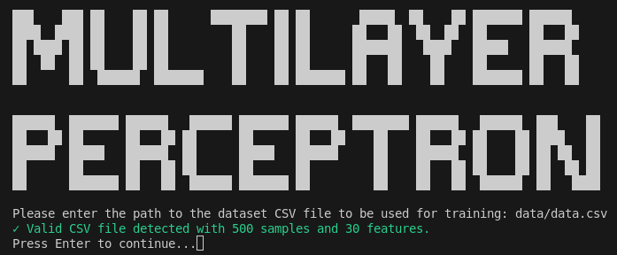
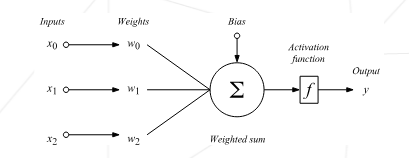
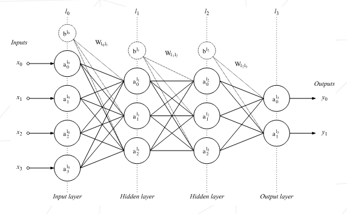
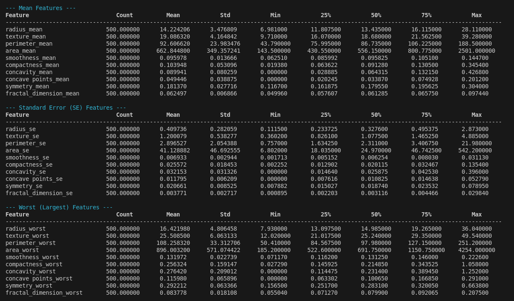
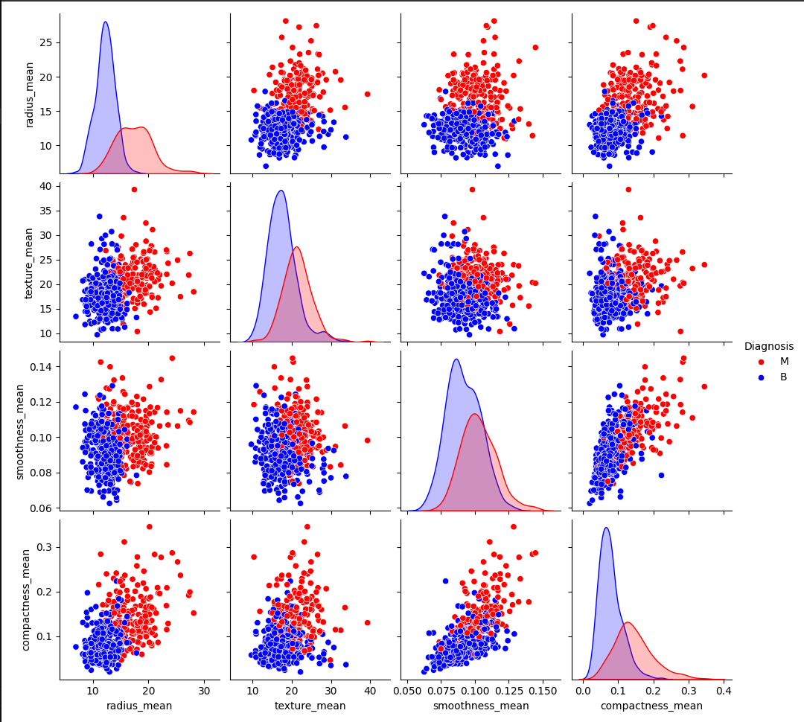
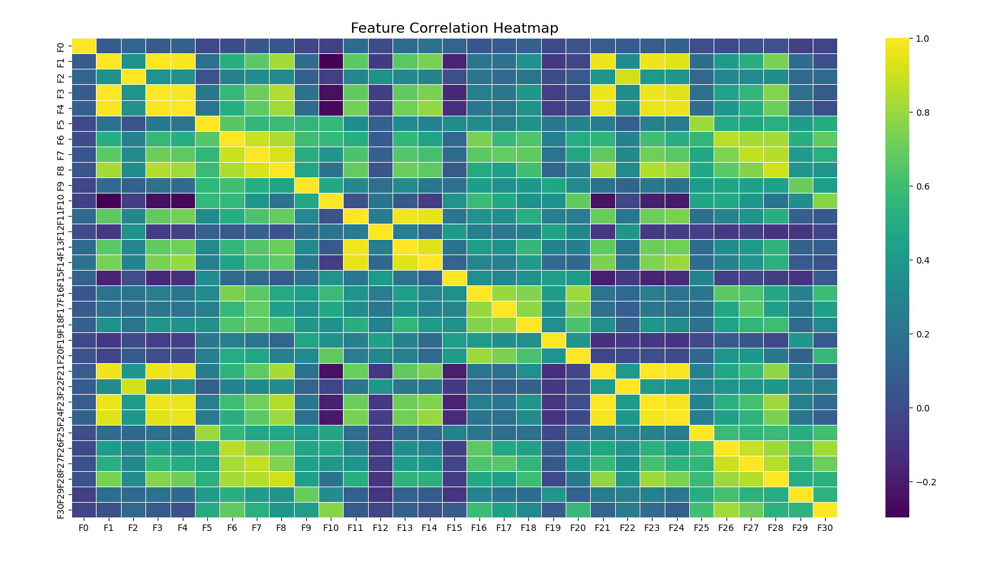
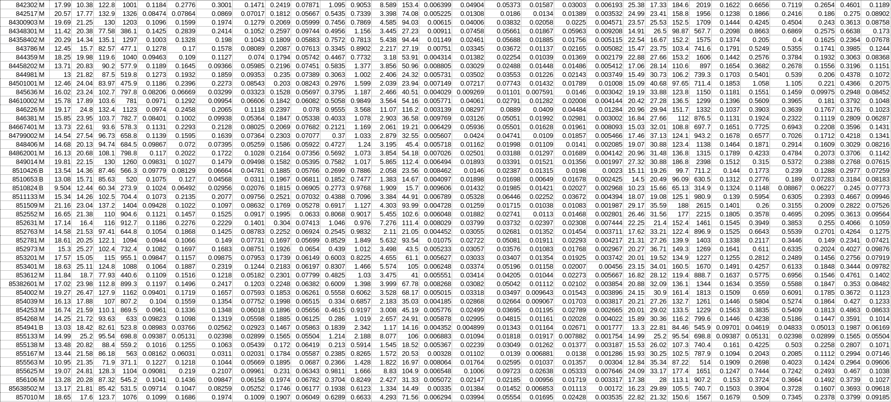
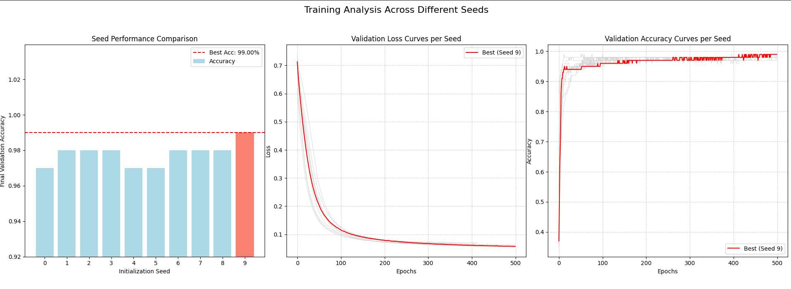
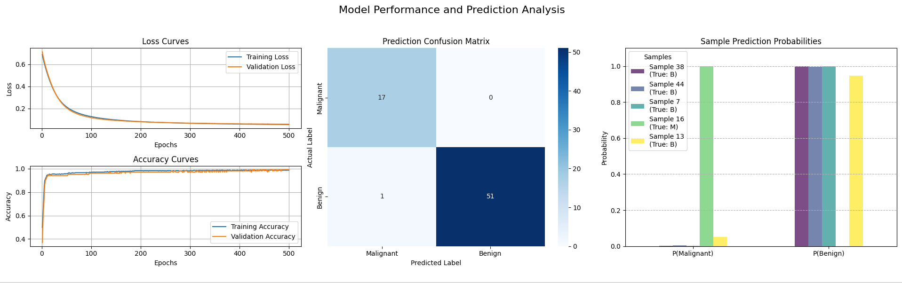

# Multilayer Perceptron - Binary Classification with Neural Networks

## Project Overview

The Multilayer Perceptron (MLP) project is a comprehensive implementation of a neural network classifier designed for binary classification tasks. This project demonstrates the fundamental concepts of deep learning by building a fully-connected neural network from scratch using only NumPy for mathematical operations.

The implementation focuses on the Wisconsin Breast Cancer Dataset (WBCD), a well-known medical dataset containing 30 numerical features extracted from digitized images of breast cancer cell nuclei. The goal is to classify tumors as either malignant (M) or benign (B) based on these morphological characteristics.



### What is a Multilayer Perceptron?

A **Multilayer Perceptron (MLP)** is a type of artificial neural network that consists of multiple layers of interconnected nodes (neurons). Unlike simple linear classifiers, MLPs can learn complex, non-linear patterns in data through the use of:

- **Multiple hidden layers** that extract and transform features
- **Non-linear activation functions** that enable complex decision boundaries
- **Backpropagation algorithm** for learning optimal weights
- **Gradient descent optimization** for parameter updates

### Key Concepts

The project implements and demonstrates several fundamental machine learning and neural network concepts:

- **Feedforward Neural Networks**: Data flows from input through hidden layers to output
- **Backpropagation**: Error propagation backward to update weights
- **Activation Functions**: ReLU for hidden layers, Softmax for output classification
- **Loss Functions**: Categorical cross-entropy for multi-class probability optimization
- **Regularization**: Early stopping to prevent overfitting
- **Data Preprocessing**: Normalization and missing value imputation
- **Validation Strategies**: Train/validation splitting with seed optimization

### Project Aims

This implementation serves multiple educational and practical purposes:

- **Educational**: Understand neural network fundamentals without black-box libraries
- **Practical**: Achieve high accuracy (>95%) on breast cancer classification
- **Methodological**: Implement proper machine learning pipelines and validation
- **Visualization**: Provide comprehensive data exploration and training analysis tools

### Key Requirements

The project must satisfy several technical and methodological requirements:

- **From-scratch Implementation**: Build neural networks using only NumPy and basic libraries
- **Configurable Architecture**: Support various hidden layer configurations and activation functions
- **Robust Training**: Implement early stopping, batch processing, and seed optimization
- **Data Visualization**: Comprehensive exploratory data analysis tools
- **Model Persistence**: Save and load trained models with preprocessing parameters
- **Performance Evaluation**: Detailed training metrics and visualization of learning curves

### Technical Constraints

The implementation operates under specific constraints to ensure educational value:

- **No ML Libraries**: Cannot use scikit-learn, TensorFlow, PyTorch, or similar frameworks
- **Mathematical Operations**: Only NumPy, Pandas, and Matplotlib allowed
- **Manual Implementation**: All neural network components built from mathematical foundations
- **Memory Efficiency**: Handle datasets that fit in memory with batch processing
- **Numerical Stability**: Implement safeguards against overflow and underflow

## Table of Contents

1. [Setup and Installation](#setup-and-installation)
   - [Prerequisites](#prerequisites)
   - [Installation Steps](#installation-steps)
   - [Running the Application](#running-the-application)
2. [Understanding Multilayer Perceptrons](#understanding-multilayer-perceptrons)
   - [What is a Perceptron?](#what-is-a-perceptron)
   - [Neural Network Architecture](#neural-network-architecture)
   - [Layers and Their Functions](#layers-and-their-functions)
   - [Weights, Biases, and Parameters](#weights-biases-and-parameters)
3. [Orchestrator Program Guide](#orchestrator-program-guide)
   - [Main Menu Navigation](#main-menu-navigation)
   - [Parameter Configuration](#parameter-configuration)
   - [Training Options](#training-options)
   - [Visualization Tools](#visualization-tools)
4. [Project Implementation Deep Dive](#project-implementation-deep-dive)
   - [Data Exploration and Preprocessing](#data-exploration-and-preprocessing)
   - [Neural Network Architecture](#neural-network-architecture-implementation)
   - [Training Algorithm Implementation](#training-algorithm-implementation)
   - [Validation and Model Selection](#validation-and-model-selection)
   - [Prediction and Evaluation](#prediction-and-evaluation)
5. [Advanced Concepts and Techniques](#advanced-concepts-and-techniques)
   - [Activation Functions](#activation-functions)
   - [Loss Functions and Optimization](#loss-functions-and-optimization)
   - [Hyperparameter Tuning](#hyperparameter-tuning)
   - [Overfitting Prevention](#overfitting-prevention)
6. [Performance Analysis and Visualization](#performance-analysis-and-visualization)
   - [Training Curves](#training-curves)
   - [Seed Search Analysis](#seed-search-analysis)
   - [Data Visualization Tools](#data-visualization-tools)
7. [Resources and Documentation](#resources-and-documentation)

## Setup and Installation

### Prerequisites

- Python 3.8 or higher
- Virtual environment support (venv or conda)
- Basic understanding of machine learning concepts (recommended)

### Installation Steps

1. **Navigate to the project directory:**
   ```bash
   cd /path/to/MLP
   ```

2. **Run the setup script:**
   ```bash
   chmod +x setup.sh
   ./setup.sh
   ```

   The setup script will:
   - Create a virtual environment in `.venv/`
   - Install required dependencies
   - Verify the installation
   - Display usage instructions

3. **Activate the virtual environment (if not already active):**
   ```bash
   source .venv/bin/activate  # On Linux/macOS
   # or
   .venv\Scripts\activate     # On Windows
   ```

### Required Dependencies

The project uses minimal dependencies to maintain educational clarity:

- `numpy>=1.21.0` - Numerical computations and array operations
- `pandas>=1.3.0` - Data manipulation and CSV handling
- `matplotlib>=3.5.0` - Data visualization and plotting

### Running the Application

**Interactive Mode (Recommended):**
```bash
python3 MultiLayerPerceptron.py
```

This launches the orchestrator program with an interactive menu system where you can:
- Configure model parameters and training settings
- Train neural networks with automatic seed optimization
- Visualize datasets and training progress
- Make predictions and evaluate model performance
- View detailed training history and learning curves

**Dataset Requirements:**

The application expects CSV files with the following format:
- First column: Labels ('M' for malignant, 'B' for benign)
- Remaining 30 columns: Numerical features
- Optional first column: ID numbers (automatically detected and removed)

Example datasets are provided in the `data/` directory:
- `data.csv` - Complete Wisconsin Breast Cancer Dataset
- `test.csv` - Test dataset for evaluation
- Additional test files with various data quality scenarios

## Understanding Multilayer Perceptrons

### What is a Perceptron?

A **perceptron** is the fundamental building block of neural networks - a computational unit that mimics the basic function of a biological neuron. It takes multiple inputs, processes them through weighted connections, and produces a single output.




**Mathematical Foundation:**

```
output = activation_function(Σ(input_i × weight_i) + bias)
```

Where:
- `input_i` are the feature values
- `weight_i` are learnable parameters determining input importance
- `bias` is a learnable offset parameter
- `activation_function` introduces non-linearity

**Visual Representation:**
```
Inputs     Weights    Computation      Output
  x₁  ────→  w₁  ────┐
  x₂  ────→  w₂  ────┤  Σ(xᵢ×wᵢ) + b  ────→ activation(z) ────→ output
  x₃  ────→  w₃  ────┘
```

A single perceptron can only learn linearly separable patterns (like a straight line dividing two classes). This limitation led to the development of multilayer networks.

### Neural Network Architecture

A **Multilayer Perceptron** extends the single perceptron concept by connecting multiple layers of perceptrons, enabling the learning of complex, non-linear patterns.

**Network Topology:**
```
Input Layer    Hidden Layer 1   Hidden Layer 2    Output Layer
     x₁ ────────→ h₁₁ ────────→ h₂₁ ────────→ o₁ (Malignant)
     x₂ ────────→ h₁₂ ────────→ h₂₂ ────────→ o₂ (Benign)
     x₃ ────────→ h₁₃ ────────→ h₂₃
     ⋮           ⋮               ⋮
     x₃₀────────→ h₁ₙ ────────→ h₂ₘ
```

**Information Flow:**
1. **Forward Pass**: Data flows from left to right through the network
2. **Each Connection**: Represents a learnable weight parameter
3. **Each Node**: Applies an activation function to its inputs
4. **Final Output**: Probability distribution over classes

### Layers and Their Functions

#### Input Layer

The **input layer** serves as the entry point for data into the neural network. It doesn't perform any computations but simply receives and distributes the feature values.



**In our implementation:**
- **Size**: 30 neurons (one for each feature in the breast cancer dataset)
- **Function**: Receives preprocessed feature values
- **Features**: radius_mean, texture_mean, perimeter_mean, area_mean, etc.
- **Range**: Normalized to [0,1] after preprocessing

**Code Implementation:**
```python
# Input layer size determined by feature count
input_size = X_train.shape[0]  # 30 features
layer_dims = [input_size] + hidden_layers + [output_size]
```

#### Hidden Layers

**Hidden layers** are intermediate processing layers that extract and transform features from the input data. They enable the network to learn complex, hierarchical representations.

**Key Characteristics:**
- **Feature Extraction**: Each hidden layer learns different feature combinations
- **Non-linearity**: Activation functions enable complex decision boundaries
- **Hierarchical Learning**: Earlier layers learn simple patterns, later layers combine them
- **Configurable Size**: Number of neurons determines network capacity

**In our implementation:**
```python
# Default: 2 hidden layers with 24 neurons each
CONFIG['model']['architecture'] = [24, 24]
CONFIG['model']['activations'] = ['relu', 'relu']
```

**Layer Computation:**
```python
def forward_layer(X, weights, bias, activation):
    Z = np.dot(weights, X) + bias  # Linear transformation
    A = activation_function(Z)      # Non-linear activation
    return A
```

#### Output Layer

The **output layer** produces the final classification decisions. For binary classification, it outputs class probabilities.

**Configuration:**
- **Size**: 2 neurons (one for each class: malignant, benign)
- **Activation**: Softmax (converts raw scores to probabilities)
- **Output**: Probability distribution summing to 1.0

**Mathematical Process:**
```python
# Raw scores (logits)
z₁ = score_for_malignant
z₂ = score_for_benign

# Softmax conversion to probabilities
exp_z = np.exp([z₁, z₂])
probabilities = exp_z / np.sum(exp_z)
# Result: [P(malignant), P(benign)] where sum = 1.0
```

### Weights, Biases, and Parameters

#### Weights

**Weights** are the most important learnable parameters in the network. They determine the strength and direction of connections between neurons.

**Initialization Strategy:**
```python
# 'Kaiming He' initialization for ReLU networks
weights = np.random.randn(output_size, input_size) * np.sqrt(2.0 / input_size)
```

**Weight Interpretation:**
- **Positive weights**: Increase activation when input is positive
- **Negative weights**: Decrease activation when input is positive
- **Large magnitude**: Strong influence on the output
- **Small magnitude**: Weak influence on the output

**Evolution During Training:**
1. **Random Initialization**: Weights start with small random values
2. **Gradient Updates**: Backpropagation adjusts weights based on errors
3. **Convergence**: Weights stabilize when optimal patterns are learned

#### Biases

**Biases** provide additional flexibility by allowing activation functions to shift along the input axis.

**Mathematical Role:**
```python
# Without bias: activation can only pass through origin
output = activation(w₁×x₁ + w₂×x₂)

# With bias: activation can shift anywhere
output = activation(w₁×x₁ + w₂×x₂ + bias)
```

**Practical Impact:**
- **Flexibility**: Enables learning patterns that don't pass through zero
- **Decision Boundaries**: Allows shifting classification thresholds
- **Model Capacity**: Increases the network's representational power

**Initialization:**
```python
# Biases typically start at zero
bias = np.zeros((output_size, 1))
```

## Orchestrator Program Guide

The orchestrator program provides an interactive interface for configuring, training, and evaluating multilayer perceptrons. This section details all available options and their functionality.

### Main Menu Navigation

When you launch the application, you'll see the main menu with these options:

```
Multilayer Perceptron Project
Current Training Dataset: data/data.csv
----------------------------------------
c - Configure Parameters
t - Train the model
h - See training history (appears after training)
p - Predict and evaluate
v - Visualize dataset
q - Quit
```

**Option Details:**

- **c (Configure Parameters)**: Access detailed parameter configuration menu
- **t (Train the model)**: Start the training process with current parameters
- **h (See training history)**: View detailed logs from previous training sessions
- **p (Predict and evaluate)**: Make predictions on test datasets and evaluate performance
- **v (Visualize dataset)**: Access data exploration and visualization tools
- **q (Quit)**: Exit the application

### Parameter Configuration

The configuration menu allows you to customize both model architecture and training parameters:

#### Model Parameters

**1. Learning Rate (default: 0.01)**
- Controls the step size for weight updates during training
- **Range**: Typically 0.001 to 0.1
- **Impact**: Higher values train faster but may overshoot optima
- **Recommendation**: Start with 0.01, increase if training is slow, decrease if loss oscillates

**2. Epochs (default: 500)**
- Maximum number of complete passes through the training data
- **Range**: 100 to 2000+ depending on dataset complexity
- **Impact**: More epochs allow more learning but may cause overfitting
- **Note**: Early stopping prevents unnecessary training

**3. Batch Size (default: 32)**
- Number of samples processed before updating weights
- **Options**: 1 (stochastic), 32 (mini-batch), or full dataset size (batch)
- **Impact**: Larger batches provide stable gradients but use more memory
- **Recommendation**: 32 works well for most datasets

**4. Early Stopping Patience (default: 10)**
- Number of epochs to wait for validation improvement before stopping
- **Range**: 5-50 epochs
- **Purpose**: Prevents overfitting by stopping when validation loss stops improving
- **Setting to 0**: Disables early stopping

**5. Hidden Layers Architecture (default: [24, 24])**
- Defines the size of each hidden layer
- **Format**: Space-separated integers (e.g., "24 24 12" for three layers)
- **Considerations**: 
  - More neurons = higher capacity but risk of overfitting
  - More layers = ability to learn complex patterns
  - Rule of thumb: Start with 2 layers, each with 2/3 of input size

**6. Hidden Layers Activations (default: ['relu', 'relu'])**
- Activation function for each hidden layer
- **Options**: 'relu' or 'sigmoid'
- **ReLU**: Faster training, less vanishing gradient problems
- **Sigmoid**: Smooth gradients but can cause vanishing gradients

#### Split Parameters

**7. Validation Set Size (default: 20%)**
- Percentage of data reserved for validation during training
- **Range**: 10-30% of total dataset
- **Purpose**: Monitor overfitting and select best model

**8. Seed Mode (default: 'auto')**
- **Auto Mode**: Automatically searches for the best initialization seed
  - Tests up to 25 different random initializations
  - Targets 99% validation accuracy
  - Selects the seed with highest validation performance
- **Manual Mode**: Uses a specified seed for reproducible results
  - Useful for debugging and comparison
  - Requires manual seed value (default: 42)

### Training Options

#### Automatic Seed Search

When using auto mode, the training process:

1. **Creates Train/Validation Split**: Fixed 80/20 split using seed 42
2. **Tests Multiple Seeds**: Tries different initialization seeds (0-24)
3. **Evaluates Performance**: Measures validation accuracy for each seed
4. **Early Success Detection**: Stops if 99% accuracy is achieved
5. **Best Model Selection**: Chooses the seed with highest validation accuracy
6. **Comprehensive Logging**: Records detailed training history for all seeds

#### Manual Seed Training

With manual seed mode:
1. **Fixed Initialization**: Uses specified seed for weight initialization
2. **Single Training Run**: Trains one model with chosen parameters
3. **Detailed Output**: Shows epoch-by-epoch training progress
4. **Early Stopping**: Still applies patience-based stopping

### Training History Viewer

After training, the history viewer provides detailed analysis:

#### Seed Performance Overview
- **Best Seed Highlighting**: Clearly shows the highest-performing seed
- **Accuracy Comparison**: Lists all tested seeds with final accuracies
- **Pagination**: Handles large numbers of tested seeds efficiently

#### Detailed Training Logs
- **Epoch-by-Epoch Progress**: Shows loss and accuracy for each epoch
- **Color-Coded Output**: 
  - **Green**: Training metrics (loss, accuracy)
  - **Yellow**: Validation metrics (val_loss, val_acc)
  - **Bold**: Epoch numbers and important information
- **Early Stopping Indicators**: Shows when and why training stopped

#### Navigation Options
- **Individual Seed Review**: Select any seed to see its complete training log
- **Pagination Controls**: Navigate through multiple pages of seeds
- **Full History View**: See all training logs in one comprehensive display

### Visualization Tools

The visualization menu provides comprehensive data exploration capabilities:

#### Dataset Description (d)
- **Statistical Summary**: Count, mean, std, min, max, percentiles for all features
- **Feature Grouping**: Organizes features by type (mean, standard error, worst)
- **Missing Value Analysis**: Identifies and reports data quality issues
- **Class Distribution**: Shows balance between malignant and benign samples



#### Pair Plot (p)
- **Feature Relationships**: Scatter plots for key feature combinations
- **Class Separation**: Color-coded by diagnosis (malignant/benign)
- **Distribution Analysis**: Histograms on diagonal showing feature distributions
- **Pattern Recognition**: Helps identify features that separate classes well



#### Correlation Heatmap (c)
- **Feature Correlations**: Matrix showing relationships between all features
- **Redundancy Detection**: Identifies highly correlated features
- **Color Coding**: 
  - **Yellow**: Strong positive correlation
  - **Blue**: Weak correlation
  - **Purple**: Strong negative correlation
- **Feature Selection**: Helps choose independent, informative features



## Project Implementation Deep Dive

This section provides comprehensive technical details about the neural network implementation, covering every aspect from data preprocessing to model evaluation.

### Data Exploration and Preprocessing

#### Dataset Understanding

The Wisconsin Breast Cancer Dataset contains 569 samples with 30 numerical features computed from digitized images of breast cell nuclei. Each feature represents a morphological characteristic measured in three ways:

**Feature Categories:**
1. **Mean Values** (10 features): Average measurements across the cell image
2. **Standard Error** (10 features): Variability of measurements  
3. **Worst Values** (10 features): Largest (most severe) measurements

**Key Features Include:**
- **Radius**: Distance from center to perimeter points
- **Texture**: Standard deviation of gray-scale values
- **Perimeter**: Boundary length of the cell nucleus
- **Area**: Total area enclosed by the perimeter
- **Smoothness**: Local variation in radius lengths
- **Compactness**: (perimeter² / area) - 1.0
- **Concavity**: Severity of concave portions of the contour
- **Concave Points**: Number of concave portions of the contour
- **Symmetry**: Symmetry of the cell nucleus
- **Fractal Dimension**: "Coastline approximation" - 1



#### Data Preprocessing Pipeline

**Missing Value Handling:**

```python
class Preprocessor:
    def fit(self, data):
        # Convert to numeric, coercing errors to NaN
        numeric_data = self._coerce_to_numeric(data)
        
        # Calculate mean for each feature (ignoring NaN)
        self.imputation_values = np.nanmean(numeric_data, axis=0)
        
        # Replace NaN with feature means
        nan_indices = np.where(np.isnan(numeric_data))
        numeric_data[nan_indices] = np.take(self.imputation_values, nan_indices[1])
```

**Why Mean Imputation?**
- **Preserves Distribution**: Maintains overall feature statistics
- **Simple and Robust**: Works well when missing data is random
- **Consistent Application**: Same values used for training and test data

**Feature Normalization:**

```python
class Scaler:
    def fit(self, data):
        self.min = np.min(data, axis=0)
        self.max = np.max(data, axis=0)
    
    def transform(self, data):
        # Min-max scaling to [0,1]
        return (data - self.min) / (self.max - self.min + 1e-8)
```

**Why Min-Max Scaling?**
- **Equal Feature Contribution**: Prevents features with large scales from dominating
- **Stable Gradients**: Normalized inputs lead to more stable training
- **Activation Function Optimization**: [0,1] range works well with sigmoid and ReLU
- **Numerical Stability**: Small epsilon prevents division by zero

#### Train/Validation Splitting Strategy

```python
# Fixed split for consistent evaluation
np.random.seed(42)  # Reproducible splits
shuffled_indices = np.random.permutation(len(X_full))
split_point = int(len(X_full) * (1 - val_size))
train_idx = shuffled_indices[:split_point]
val_idx = shuffled_indices[split_point:]
```

**Split Characteristics:**
- **Stratification**: Maintains class balance in both sets
- **Fixed Seed**: Ensures reproducible experiments
- **Validation Size**: Default 20% provides reliable performance estimates
- **No Data Leakage**: Validation set never used for training decisions

### Neural Network Architecture Implementation

#### Layer Construction

The neural network is built dynamically based on configuration parameters:

```python
class MLP:
    def __init__(self, layer_dims, activations):
        self.layer_dims = layer_dims      # [30, 24, 24, 2] for example
        self.activations = activations + ['softmax']  # Add output activation
        self.num_layers = len(layer_dims)
        self._initialize_parameters()
```

**Architecture Flexibility:**
- **Variable Depth**: Support for any number of hidden layers
- **Variable Width**: Each layer can have different numbers of neurons
- **Activation Choice**: Different activation functions per layer
- **Output Configuration**: Automatically configured for binary classification

#### Weight Initialization

**He Initialization for ReLU Networks:**

```python
def _initialize_parameters(self):
    for l in range(1, self.num_layers):
        input_size = self.layer_dims[l-1]
        output_size = self.layer_dims[l]
        
        # He initialization: optimal for ReLU activations
        self.params[f'W{l}'] = np.random.randn(output_size, input_size) * np.sqrt(2.0 / input_size)
        self.params[f'b{l}'] = np.zeros((output_size, 1))
```

**Why He Initialization?**
- **Variance Preservation**: Maintains signal strength through deep networks
- **ReLU Optimization**: Specifically designed for ReLU activation functions
- **Avoids Vanishing Gradients**: Prevents weights from becoming too small
- **Fast Convergence**: Leads to faster and more stable training

#### Forward Propagation Algorithm

The forward pass computes predictions by propagating data through the network:

```python
def forward(self, X):
    cache = {}
    A = X  # Input activations
    cache['A0'] = X
    
    for l in range(1, self.num_layers):
        A_prev = A
        
        # Linear transformation: Z = W × A + b
        W = self.params[f'W{l}']
        b = self.params[f'b{l}']
        Z = np.dot(W, A_prev) + b
        
        # Non-linear activation
        activation_func = self._get_activation_function(self.activations[l-1])
        A = activation_func(Z)
        
        # Store for backpropagation
        cache[f'Z{l}'] = Z
        cache[f'A{l}'] = A
    
    return A, cache
```

**Step-by-Step Process:**

1. **Input Layer**: Receives preprocessed feature values (30 features)
2. **Hidden Layer 1**: 
   - Linear: `Z₁ = W₁ × X + b₁` (shape: [24, 30] × [30, batch] + [24, 1])
   - Activation: `A₁ = ReLU(Z₁)` (introduces non-linearity)
3. **Hidden Layer 2**:
   - Linear: `Z₂ = W₂ × A₁ + b₂` (shape: [24, 24] × [24, batch] + [24, 1])
   - Activation: `A₂ = ReLU(Z₂)` (further feature extraction)
4. **Output Layer**:
   - Linear: `Z₃ = W₃ × A₂ + b₃` (shape: [2, 24] × [24, batch] + [2, 1])
   - Activation: `A₃ = Softmax(Z₃)` (probability distribution)

**Mathematical Details:**

```python
# For each sample in batch:
# Hidden Layer 1 (24 neurons)
z₁ⱼ = Σᵢ₌₀²⁹ w₁ⱼᵢ × xᵢ + b₁ⱼ  # j = 0 to 23
a₁ⱼ = max(0, z₁ⱼ)              # ReLU activation

# Hidden Layer 2 (24 neurons)  
z₂ₖ = Σⱼ₌₀²³ w₂ₖⱼ × a₁ⱼ + b₂ₖ  # k = 0 to 23
a₂ₖ = max(0, z₂ₖ)              # ReLU activation

# Output Layer (2 neurons)
z₃ₘ = Σₖ₌₀²³ w₃ₘₖ × a₂ₖ + b₃ₘ  # m = 0 to 1
exp_z₃ = [e^z₃₀, e^z₃₁]
a₃ₘ = exp_z₃ₘ / Σ(exp_z₃)      # Softmax normalization
```

### Training Algorithm Implementation

#### Backpropagation Algorithm

Backpropagation computes gradients by propagating errors backward through the network:

```python
def backward(self, Y_true, cache):
    grads = {}
    m = Y_true.shape[1]  # Number of samples
    
    # Output layer error (softmax + cross-entropy derivative)
    A_final = cache[f'A{self.num_layers-1}']
    dZ = A_final - Y_true
    
    # Backpropagate through all layers
    for l in reversed(range(1, self.num_layers)):
        A_prev = cache[f'A{l-1}']
        
        # Compute gradients
        grads[f'dW{l}'] = np.dot(dZ, A_prev.T) / m
        grads[f'db{l}'] = np.sum(dZ, axis=1, keepdims=True) / m
        
        if l > 1:  # Not the first layer
            W = self.params[f'W{l}']
            dA_prev = np.dot(W.T, dZ)
            
            # Apply activation derivative
            Z_prev = cache[f'Z{l-1}']
            activation_prime = self._get_activation_prime(self.activations[l-2])
            dZ = dA_prev * activation_prime(Z_prev)
    
    return grads
```

**Mathematical Foundation:**

The chain rule of calculus enables gradient computation:

```
∂Loss/∂W = ∂Loss/∂A × ∂A/∂Z × ∂Z/∂W
```

**Layer-by-Layer Gradient Computation:**

1. **Output Layer**:
   ```python
   # For softmax + cross-entropy, gradient simplifies to:
   dZ₃ = A₃ - Y_true  # A₃ is predicted probabilities, Y_true is one-hot labels
   dW₃ = (1/m) × dZ₃ × A₂ᵀ
   db₃ = (1/m) × sum(dZ₃, axis=1)
   ```

2. **Hidden Layer 2**:
   ```python
   dA₂ = W₃ᵀ × dZ₃          # Error propagated from output
   dZ₂ = dA₂ × ReLU'(Z₂)    # Apply ReLU derivative
   dW₂ = (1/m) × dZ₂ × A₁ᵀ
   db₂ = (1/m) × sum(dZ₂, axis=1)
   ```

3. **Hidden Layer 1**:
   ```python
   dA₁ = W₂ᵀ × dZ₂          # Error propagated from layer 2
   dZ₁ = dA₁ × ReLU'(Z₁)    # Apply ReLU derivative
   dW₁ = (1/m) × dZ₁ × Xᵀ
   db₁ = (1/m) × sum(dZ₁, axis=1)
   ```

#### Gradient Descent Optimization

Weight updates use the computed gradients to minimize the loss function:

```python
def update_params(self, grads, learning_rate):
    for l in range(1, self.num_layers):
        self.params[f'W{l}'] -= learning_rate * grads[f'dW{l}']
        self.params[f'b{l}'] -= learning_rate * grads[f'db{l}']
```

**Optimization Process:**

1. **Gradient Computation**: Backpropagation calculates ∂Loss/∂W for all parameters
2. **Parameter Update**: Move parameters in direction opposite to gradient
3. **Learning Rate**: Controls step size (too large = instability, too small = slow convergence)
4. **Iterative Process**: Repeat for multiple epochs until convergence

**Mini-Batch Processing:**

```python
def fit(self, X_train, y_train, X_val, y_val, epochs, learning_rate, batch_size):
    for epoch in range(epochs):
        # Shuffle training data
        indices = np.random.permutation(X_train.shape[1])
        
        # Process in mini-batches
        for i in range(0, X_train.shape[1], batch_size):
            batch_indices = indices[i:i+batch_size]
            X_batch = X_train[:, batch_indices]
            y_batch = y_train[:, batch_indices]
            
            # Forward and backward pass
            Y_pred, cache = self.forward(X_batch)
            grads = self.backward(y_batch, cache)
            self.update_params(grads, learning_rate)
```

**Mini-Batch Benefits:**
- **Memory Efficiency**: Processes smaller chunks of data
- **Gradient Stability**: Averages gradients over multiple samples
- **Computational Efficiency**: Vectorized operations on reasonable-sized batches
- **Stochastic Updates**: Introduces noise that can help escape local minima

### Loss Functions and Optimization

#### Categorical Cross-Entropy Loss

For multi-class classification, we use categorical cross-entropy loss:

```python
def compute_loss(Y_true, Y_pred):
    m = Y_true.shape[1]
    # Avoid log(0) with small epsilon
    epsilon = 1e-8
    loss = -np.sum(Y_true * np.log(Y_pred + epsilon)) / m
    return loss
```

**Mathematical Explanation:**

For each sample i and class j:
```
Loss = -Σᵢ Σⱼ yᵢⱼ × log(ŷᵢⱼ)
```

Where:
- `yᵢⱼ` is 1 if sample i belongs to class j, 0 otherwise (one-hot encoding)
- `ŷᵢⱼ` is the predicted probability that sample i belongs to class j

**Why Cross-Entropy?**
- **Probability Interpretation**: Naturally works with probability outputs
- **Smooth Gradients**: Provides meaningful gradients even for confident predictions
- **Class Separation**: Encourages high confidence for correct predictions
- **Numerical Stability**: With proper epsilon handling, avoids numerical issues

#### Accuracy Computation

```python
def compute_accuracy(Y_true, Y_pred):
    y_true_labels = np.argmax(Y_true, axis=0)  # Convert one-hot to indices
    y_pred_labels = np.argmax(Y_pred, axis=0)  # Find highest probability class
    accuracy = np.mean(y_true_labels == y_pred_labels)
    return accuracy
```

### Validation and Model Selection

#### Early Stopping Implementation

Early stopping prevents overfitting by monitoring validation performance:

```python
def fit_with_early_stopping(self, X_train, y_train, X_val, y_val, 
                           epochs, learning_rate, batch_size, patience):
    best_val_loss = float('inf')
    best_params = None
    epochs_no_improve = 0
    best_epoch = 0
    
    for epoch in range(epochs):
        # Training step
        # ... (forward, backward, update)
        
        # Validation evaluation
        val_pred, _ = self.forward(X_val)
        val_loss = compute_loss(y_val, val_pred)
        
        if val_loss < best_val_loss:
            best_val_loss = val_loss
            best_params = copy.deepcopy(self.params)
            epochs_no_improve = 0
            best_epoch = epoch
        else:
            epochs_no_improve += 1
            
        # Check early stopping condition
        if patience > 0 and epochs_no_improve >= patience:
            print(f"Early stopping at epoch {epoch}")
            print(f"Restoring best weights from epoch {best_epoch}")
            self.params = best_params
            break
```

**Early Stopping Benefits:**
- **Overfitting Prevention**: Stops training when model starts memorizing training data
- **Computational Efficiency**: Avoids unnecessary training epochs
- **Best Model Selection**: Automatically selects the model with best validation performance
- **Robustness**: Provides consistent results across different runs

#### Seed Search Strategy

The automatic seed search finds the best weight initialization:

```python
def automatic_seed_search(max_seeds=25, target_accuracy=0.99):
    best_seed = -1
    best_accuracy = 0.0
    seed_results = []
    
    for seed in range(max_seeds):
        np.random.seed(seed)
        
        # Initialize and train model
        model = MLP(layer_dims, activations)
        history = model.fit(X_train, y_train, X_val, y_val, 
                          epochs, learning_rate, batch_size, patience)
        
        # Evaluate validation performance
        _, val_acc = model.evaluate(X_val, y_val)
        seed_results.append({'seed': seed, 'accuracy': val_acc, 'history': history})
        
        # Update best model
        if val_acc > best_accuracy:
            best_accuracy = val_acc
            best_seed = seed
            best_model = model
            
        # Early success detection
        if val_acc >= target_accuracy:
            print(f"Target accuracy {target_accuracy*100:.1f}% achieved!")
            break
            
    return best_model, best_seed, seed_results
```

**Why Seed Search?**
- **Weight Initialization Sensitivity**: Different initializations can lead to different local optima
- **Performance Optimization**: Finds the initialization that leads to best validation performance
- **Statistical Robustness**: Reduces dependence on random initialization luck
- **Reproducibility**: Once best seed is found, results are reproducible



### Prediction and Evaluation

#### Making Predictions

The prediction process applies the trained model to new data:

```python
def predict_on_test_data(model, preprocessor, test_filepath):
    # Load test data
    X_test, _ = load_data(test_filepath)
    
    # Apply same preprocessing as training
    X_test_processed = preprocessor.transform(X_test).T
    
    # Generate predictions
    Y_pred, _ = model.forward(X_test_processed)
    
    # Convert probabilities to class labels
    predicted_labels = np.argmax(Y_pred, axis=0)
    
    # Convert to original labels
    label_map = {0: 'B', 1: 'M'}  # Benign, Malignant
    predicted_classes = [label_map[label] for label in predicted_labels]
    
    return predicted_classes, Y_pred
```

**Key Considerations:**
- **Consistent Preprocessing**: Test data must use training statistics
- **No Data Leakage**: Test preprocessing uses only training-derived parameters
- **Probability Outputs**: Raw probabilities available for confidence analysis
- **Class Mapping**: Consistent label encoding between training and prediction

#### Performance Evaluation

```python
def evaluate_model_performance(y_true, y_pred, y_pred_proba):
    # Basic accuracy
    accuracy = np.mean(y_true == y_pred)
    
    # Confusion matrix
    unique_labels = np.unique(np.concatenate([y_true, y_pred]))
    cm = confusion_matrix(y_true, y_pred, labels=unique_labels)
    
    # Per-class metrics
    for i, label in enumerate(unique_labels):
        true_positives = cm[i, i]
        false_positives = np.sum(cm[:, i]) - true_positives
        false_negatives = np.sum(cm[i, :]) - true_positives
        
        precision = true_positives / (true_positives + false_positives)
        recall = true_positives / (true_positives + false_negatives)
        f1_score = 2 * (precision * recall) / (precision + recall)
        
        print(f"Class {label}: Precision={precision:.3f}, Recall={recall:.3f}, F1={f1_score:.3f}")
    
    return accuracy, cm
```



## Advanced Concepts and Techniques

### Activation Functions

#### ReLU (Rectified Linear Unit)

**Mathematical Definition:**
```python
def relu(z):
    return np.maximum(0, z)

def relu_prime(z):
    return np.where(z > 0, 1, 0)
```

**Properties:**
- **Non-linearity**: Enables learning of complex patterns
- **Computational Efficiency**: Simple max operation
- **Gradient Flow**: Doesn't suffer from vanishing gradients for positive inputs
- **Sparsity**: Produces sparse activations (many zeros)

**Advantages:**
- **Fast Training**: Gradients are either 0 or 1, leading to efficient updates
- **Biological Inspiration**: Mimics neurons that fire or don't fire
- **Deep Network Compatibility**: Works well in deep architectures

**Disadvantages:**
- **Dying ReLU Problem**: Neurons can become permanently inactive
- **Not Zero-Centered**: All outputs are positive
- **Unbounded**: No upper limit on activation values

#### Sigmoid

**Mathematical Definition:**
```python
def sigmoid(z):
    return 1 / (1 + np.exp(-np.clip(z, -500, 500)))  # Clipping for numerical stability

def sigmoid_prime(z):
    s = sigmoid(z)
    return s * (1 - s)
```

**Properties:**
- **Bounded Output**: Values between 0 and 1
- **Smooth Gradient**: Differentiable everywhere
- **Probability Interpretation**: Output can be interpreted as probability

**Advantages:**
- **Historical Significance**: Well-studied and understood
- **Smooth Transitions**: Gradual activation changes
- **Binary Classification**: Natural for binary decisions

**Disadvantages:**
- **Vanishing Gradients**: Gradients become very small for large |z|
- **Not Zero-Centered**: Outputs always positive
- **Computational Cost**: Exponential function is expensive

#### Softmax (Output Layer)

**Mathematical Definition:**
```python
def softmax(z):
    # Numerical stability: subtract max to prevent overflow
    exp_z = np.exp(z - np.max(z, axis=0, keepdims=True))
    return exp_z / np.sum(exp_z, axis=0, keepdims=True)
```

**Properties:**
- **Probability Distribution**: Outputs sum to 1
- **Multi-class Extension**: Generalizes sigmoid to multiple classes
- **Relative Scaling**: Emphasizes differences between classes

**Why Softmax for Output?**
- **Probability Interpretation**: Each output represents class probability
- **Competition**: High activation for one class suppresses others
- **Cross-Entropy Compatibility**: Works naturally with cross-entropy loss
- **Gradient Simplification**: ∂Loss/∂z = y_pred - y_true for softmax + cross-entropy

### Hyperparameter Tuning

#### Learning Rate Optimization

**Learning Rate Effects:**

```python
# Too High (e.g., 0.1): 
# - Loss oscillates wildly
# - May diverge completely
# - Overshoots optimal parameters

# Too Low (e.g., 0.0001):
# - Very slow convergence
# - May get stuck in plateaus
# - Requires many epochs

# Optimal Range (0.001 - 0.01):
# - Steady loss decrease
# - Reasonable convergence speed
# - Stable training
```

**Adaptive Strategies:**
- **Learning Rate Decay**: Reduce learning rate over time
- **Plateau Detection**: Reduce when loss stops improving
- **Validation-Based**: Adjust based on validation performance

#### Architecture Selection

**Hidden Layer Size Guidelines:**

```python
# Rule of Thumb for Hidden Layer Size:
# - Start with 2/3 of input size
# - For 30 input features: try 20, 24, or 32 neurons
# - Adjust based on performance and overfitting

# Number of Hidden Layers:
# - 1 layer: Simple patterns, linear-like separation
# - 2 layers: Most problems, good balance
# - 3+ layers: Complex patterns, risk of overfitting

# Example configurations:
architectures = [
    [20],           # Single hidden layer
    [24, 24],       # Two equal layers
    [32, 16],       # Decreasing size
    [16, 24, 16],   # Bottleneck architecture
]
```

**Capacity vs. Generalization Trade-off:**
- **More Parameters**: Higher capacity but greater overfitting risk
- **Fewer Parameters**: Better generalization but may underfit
- **Regularization**: Techniques to maintain capacity while preventing overfitting

#### Batch Size Impact

**Batch Size Characteristics:**

```python
# Batch Size = 1 (Stochastic Gradient Descent):
# - High variance in gradients
# - Can escape local minima
# - Slow convergence
# - High computational overhead

# Batch Size = 32 (Mini-batch):
# - Good balance of stability and efficiency
# - Reasonable gradient estimates
# - Efficient computation
# - Standard choice for many problems

# Batch Size = Full Dataset (Batch Gradient Descent):
# - Most accurate gradients
# - Stable convergence
# - High memory requirements
# - May get stuck in local minima
```

### Overfitting Prevention

#### Early Stopping Mechanism

**Implementation Details:**

```python
class EarlyStopping:
    def __init__(self, patience=10, min_delta=0.001):
        self.patience = patience
        self.min_delta = min_delta
        self.best_loss = float('inf')
        self.wait = 0
        self.best_weights = None
        
    def __call__(self, val_loss, model):
        if val_loss < self.best_loss - self.min_delta:
            self.best_loss = val_loss
            self.wait = 0
            self.best_weights = copy.deepcopy(model.params)
            return False  # Continue training
        else:
            self.wait += 1
            if self.wait >= self.patience:
                model.params = self.best_weights  # Restore best weights
                return True  # Stop training
        return False
```

**Early Stopping Benefits:**
- **Automatic Stopping**: No need to guess optimal epoch count
- **Best Model Selection**: Automatically selects model at peak validation performance
- **Overfitting Prevention**: Stops before memorization begins
- **Computational Efficiency**: Avoids unnecessary training

#### Validation Strategy

**Training Process Monitoring:**

```python
def monitor_overfitting(train_losses, val_losses):
    # Signs of overfitting:
    # 1. Training loss continues decreasing while validation loss increases
    # 2. Large gap between training and validation accuracy
    # 3. Validation metrics plateau while training metrics improve
    
    if len(train_losses) > 10:
        recent_train_trend = np.mean(train_losses[-5:]) - np.mean(train_losses[-10:-5])
        recent_val_trend = np.mean(val_losses[-5:]) - np.mean(val_losses[-10:-5])
        
        if recent_train_trend < 0 and recent_val_trend > 0:
            print("Warning: Possible overfitting detected!")
            print(f"Training loss trend: {recent_train_trend:.4f}")
            print(f"Validation loss trend: {recent_val_trend:.4f}")
```

## Performance Analysis and Visualization

### Training Curves

The implementation provides comprehensive visualization of training progress through multiple types of learning curves.

#### Loss and Accuracy Curves

```python
def plot_learning_curves(history):
    fig, (ax1, ax2) = plt.subplots(1, 2, figsize=(15, 5))
    
    # Loss curves
    epochs = range(1, len(history['train_loss']) + 1)
    ax1.plot(epochs, history['train_loss'], 'b-', label='Training Loss', linewidth=2)
    ax1.plot(epochs, history['val_loss'], 'r-', label='Validation Loss', linewidth=2)
    ax1.set_title('Model Loss Over Time')
    ax1.set_xlabel('Epoch')
    ax1.set_ylabel('Loss')
    ax1.legend()
    ax1.grid(True, alpha=0.3)
    
    # Accuracy curves
    ax2.plot(epochs, history['train_acc'], 'b-', label='Training Accuracy', linewidth=2)
    ax2.plot(epochs, history['val_acc'], 'r-', label='Validation Accuracy', linewidth=2)
    ax2.set_title('Model Accuracy Over Time')
    ax2.set_xlabel('Epoch')
    ax2.set_ylabel('Accuracy')
    ax2.legend()
    ax2.grid(True, alpha=0.3)
    
    plt.tight_layout()
    plt.show()
```

**Curve Interpretation:**

**Healthy Training Curves:**
- Both training and validation loss decrease together
- Small gap between training and validation accuracy
- Smooth, monotonic improvement
- Early stopping occurs when validation loss starts increasing

**Overfitting Indicators:**
- Training loss continues decreasing while validation loss increases
- Large gap between training and validation accuracy
- Validation accuracy plateaus while training accuracy improves

**Underfitting Indicators:**
- Both training and validation loss remain high
- Poor performance on both training and validation sets
- Curves plateau early without reaching good performance

### Seed Search Analysis

The automatic seed search generates comprehensive performance analysis across multiple initializations:

```python
def plot_seed_search_results(seed_results):
    seeds = [result['seed'] for result in seed_results]
    accuracies = [result['accuracy'] for result in seed_results]
    
    fig, (ax1, ax2) = plt.subplots(2, 1, figsize=(12, 10))
    
    # Seed performance comparison
    bars = ax1.bar(seeds, accuracies, color=['green' if acc >= 0.99 else 'orange' if acc >= 0.95 else 'red' for acc in accuracies])
    ax1.set_title('Validation Accuracy by Initialization Seed')
    ax1.set_xlabel('Seed Number')
    ax1.set_ylabel('Validation Accuracy')
    ax1.axhline(y=0.99, color='red', linestyle='--', label='Target Accuracy (99%)')
    ax1.legend()
    ax1.grid(True, alpha=0.3)
    
    # Add accuracy labels on bars
    for bar, acc in zip(bars, accuracies):
        height = bar.get_height()
        ax1.text(bar.get_x() + bar.get_width()/2., height + 0.001,
                f'{acc:.3f}', ha='center', va='bottom', fontsize=8)
    
    # Validation loss curves for all seeds
    for i, result in enumerate(seed_results):
        epochs = range(1, len(result['history']['val_loss']) + 1)
        alpha = 1.0 if result['accuracy'] == max(accuracies) else 0.3
        linewidth = 3 if result['accuracy'] == max(accuracies) else 1
        ax2.plot(epochs, result['history']['val_loss'], 
                alpha=alpha, linewidth=linewidth, 
                label=f"Seed {result['seed']}" if result['accuracy'] == max(accuracies) else "")
    
    ax2.set_title('Validation Loss Curves for All Seeds')
    ax2.set_xlabel('Epoch')
    ax2.set_ylabel('Validation Loss')
    ax2.legend()
    ax2.grid(True, alpha=0.3)
    
    plt.tight_layout()
    plt.show()
    
    # Statistics
    print(f"\nSeed Search Results:")
    print(f"Best seed: {seeds[accuracies.index(max(accuracies))]} (accuracy: {max(accuracies):.4f})")
    print(f"Worst seed: {seeds[accuracies.index(min(accuracies))]} (accuracy: {min(accuracies):.4f})")
    print(f"Mean accuracy: {np.mean(accuracies):.4f}")
    print(f"Standard deviation: {np.std(accuracies):.4f}")
    print(f"Seeds achieving >99% accuracy: {sum(1 for acc in accuracies if acc >= 0.99)}")
```

### Data Visualization Tools

#### Dataset Statistical Description

```python
def describe_dataset_comprehensive(filepath):
    """Provides detailed statistical analysis of the dataset features."""
    
    # Feature groupings for the Wisconsin Breast Cancer Dataset
    feature_groups = {
        'Mean Features': [
            'radius_mean', 'texture_mean', 'perimeter_mean', 'area_mean',
            'smoothness_mean', 'compactness_mean', 'concavity_mean',
            'concave points_mean', 'symmetry_mean', 'fractal_dimension_mean'
        ],
        'Standard Error Features': [
            'radius_se', 'texture_se', 'perimeter_se', 'area_se',
            'smoothness_se', 'compactness_se', 'concavity_se',
            'concave points_se', 'symmetry_se', 'fractal_dimension_se'
        ],
        'Worst Features': [
            'radius_worst', 'texture_worst', 'perimeter_worst', 'area_worst',
            'smoothness_worst', 'compactness_worst', 'concavity_worst',
            'concave points_worst', 'symmetry_worst', 'fractal_dimension_worst'
        ]
    }
    
    # Load and analyze data
    df = pd.read_csv(filepath, header=None)
    
    # Extract features and labels
    if df.shape[1] == 32:  # With ID column
        labels = df.iloc[:, 1]
        features = df.iloc[:, 2:]
    else:  # Without ID column
        labels = df.iloc[:, 0]
        features = df.iloc[:, 1:]
    
    # Class distribution
    class_counts = labels.value_counts()
    print(f"Dataset Overview:")
    print(f"Total samples: {len(df)}")
    print(f"Malignant (M): {class_counts.get('M', 0)} ({class_counts.get('M', 0)/len(df)*100:.1f}%)")
    print(f"Benign (B): {class_counts.get('B', 0)} ({class_counts.get('B', 0)/len(df)*100:.1f}%)")
    
    # Statistical analysis by feature group
    for group_name, feature_list in feature_groups.items():
        print(f"\n{group_name}:")
        group_data = features.iloc[:, :len(feature_list)]
        group_data.columns = feature_list
        
        # Basic statistics
        stats = group_data.describe()
        print(stats.round(4))
        
        # Missing value analysis
        missing_counts = group_data.isnull().sum()
        if missing_counts.sum() > 0:
            print(f"Missing values: {missing_counts.sum()}")
        
        # Feature correlations within group
        correlations = group_data.corr()
        high_corr_pairs = []
        for i in range(len(correlations.columns)):
            for j in range(i+1, len(correlations.columns)):
                corr_val = correlations.iloc[i, j]
                if abs(corr_val) > 0.8:
                    high_corr_pairs.append((correlations.columns[i], correlations.columns[j], corr_val))
        
        if high_corr_pairs:
            print(f"Highly correlated feature pairs (|r| > 0.8):")
            for feat1, feat2, corr in high_corr_pairs:
                print(f"  {feat1} - {feat2}: {corr:.3f}")
```

#### Correlation Analysis

```python
def plot_comprehensive_correlation_analysis(filepath):
    """Creates detailed correlation heatmaps and analysis."""
    
    # Load data
    df = pd.read_csv(filepath, header=None)
    
    # Extract feature matrix
    if df.shape[1] == 32:
        features = df.iloc[:, 2:]
    else:
        features = df.iloc[:, 1:]
    
    # Feature names
    feature_names = [
        'radius_mean', 'texture_mean', 'perimeter_mean', 'area_mean', 'smoothness_mean',
        'compactness_mean', 'concavity_mean', 'concave points_mean', 'symmetry_mean',
        'fractal_dimension_mean', 'radius_se', 'texture_se', 'perimeter_se', 'area_se',
        'smoothness_se', 'compactness_se', 'concavity_se', 'concave points_se',
        'symmetry_se', 'fractal_dimension_se', 'radius_worst', 'texture_worst',
        'perimeter_worst', 'area_worst', 'smoothness_worst', 'compactness_worst',
        'concavity_worst', 'concave points_worst', 'symmetry_worst', 'fractal_dimension_worst'
    ]
    
    features.columns = feature_names
    
    # Compute correlation matrix
    correlation_matrix = features.corr()
    
    # Create comprehensive visualization
    fig, ((ax1, ax2), (ax3, ax4)) = plt.subplots(2, 2, figsize=(20, 16))
    
    # Full correlation heatmap
    im1 = ax1.imshow(correlation_matrix, cmap='RdYlBu', vmin=-1, vmax=1)
    ax1.set_title('Complete Feature Correlation Matrix', fontsize=14)
    ax1.set_xticks(range(len(feature_names)))
    ax1.set_yticks(range(len(feature_names)))
    ax1.set_xticklabels(feature_names, rotation=45, ha='right', fontsize=8)
    ax1.set_yticklabels(feature_names, fontsize=8)
    
    # Add colorbar
    cbar1 = plt.colorbar(im1, ax=ax1)
    cbar1.set_label('Correlation Coefficient', rotation=270, labelpad=20)
    
    # Mean features correlation
    mean_features = [col for col in feature_names if 'mean' in col]
    mean_corr = correlation_matrix.loc[mean_features, mean_features]
    im2 = ax2.imshow(mean_corr, cmap='RdYlBu', vmin=-1, vmax=1)
    ax2.set_title('Mean Features Correlation', fontsize=14)
    ax2.set_xticks(range(len(mean_features)))
    ax2.set_yticks(range(len(mean_features)))
    ax2.set_xticklabels([name.replace('_mean', '') for name in mean_features], rotation=45, ha='right')
    ax2.set_yticklabels([name.replace('_mean', '') for name in mean_features])
    plt.colorbar(im2, ax=ax2)
    
    # SE features correlation
    se_features = [col for col in feature_names if '_se' in col]
    se_corr = correlation_matrix.loc[se_features, se_features]
    im3 = ax3.imshow(se_corr, cmap='RdYlBu', vmin=-1, vmax=1)
    ax3.set_title('Standard Error Features Correlation', fontsize=14)
    ax3.set_xticks(range(len(se_features)))
    ax3.set_yticks(range(len(se_features)))
    ax3.set_xticklabels([name.replace('_se', '') for name in se_features], rotation=45, ha='right')
    ax3.set_yticklabels([name.replace('_se', '') for name in se_features])
    plt.colorbar(im3, ax=ax3)
    
    # Worst features correlation
    worst_features = [col for col in feature_names if 'worst' in col]
    worst_corr = correlation_matrix.loc[worst_features, worst_features]
    im4 = ax4.imshow(worst_corr, cmap='RdYlBu', vmin=-1, vmax=1)
    ax4.set_title('Worst Features Correlation', fontsize=14)
    ax4.set_xticks(range(len(worst_features)))
    ax4.set_yticks(range(len(worst_features)))
    ax4.set_xticklabels([name.replace('_worst', '') for name in worst_features], rotation=45, ha='right')
    ax4.set_yticklabels([name.replace('_worst', '') for name in worst_features])
    plt.colorbar(im4, ax=ax4)
    
    plt.tight_layout()
    plt.show()
    
    # Identify highly correlated feature pairs
    high_corr_pairs = []
    for i in range(len(correlation_matrix.columns)):
        for j in range(i+1, len(correlation_matrix.columns)):
            corr_val = correlation_matrix.iloc[i, j]
            if abs(corr_val) > 0.8:
                high_corr_pairs.append((
                    correlation_matrix.columns[i], 
                    correlation_matrix.columns[j], 
                    corr_val
                ))
    
    print(f"\nHighly Correlated Feature Pairs (|correlation| > 0.8):")
    for feat1, feat2, corr in sorted(high_corr_pairs, key=lambda x: abs(x[2]), reverse=True):
        print(f"{feat1} - {feat2}: {corr:.3f}")
```

## Resources and Documentation

### Neural Networks and Deep Learning Fundamentals

- **[Neural Networks and Deep Learning](http://neuralnetworksanddeeplearning.com/)** - Free online book by Michael Nielsen providing intuitive explanations of neural network concepts
- **[Deep Learning Book](https://www.deeplearningbook.org/)** - Comprehensive textbook by Ian Goodfellow, Yoshua Bengio, and Aaron Courville
- **[CS231n: Convolutional Neural Networks for Visual Recognition](http://cs231n.stanford.edu/)** - Stanford course notes covering neural network fundamentals and implementation
- **[3Blue1Brown Neural Networks Series](https://www.youtube.com/playlist?list=PLZHQObOWTQDNU6R1_67000Dx_ZCJB-3pi)** - Excellent visual explanations of how neural networks work

### Mathematical Foundations

- **[Backpropagation Algorithm Explained](https://brilliant.org/wiki/backpropagation/)** - Step-by-step mathematical derivation of backpropagation
- **[Matrix Calculus for Deep Learning](https://explained.ai/matrix-calculus/)** - Essential mathematical concepts for understanding gradient computation
- **[Gradient Descent Optimization](https://ruder.io/optimizing-gradient-descent/)** - Comprehensive overview of gradient descent variants and optimization techniques
- **[Linear Algebra Review](https://www.khanacademy.org/math/linear-algebra)** - Khan Academy course covering essential linear algebra for machine learning

### Activation Functions and Loss Functions

- **[Activation Functions in Neural Networks](https://towardsdatascience.com/activation-functions-neural-networks-1cbd9f8d91d6)** - Comprehensive guide to different activation functions and their properties
- **[Understanding Cross-Entropy Loss](https://ml-cheatsheet.readthedocs.io/en/latest/loss_functions.html)** - Mathematical explanation of cross-entropy and other loss functions
- **[The Softmax Function](https://deepai.org/machine-learning-glossary-and-terms/softmax-layer)** - Detailed explanation of softmax activation for multi-class classification

### Implementation and Programming

- **[NumPy Documentation](https://numpy.org/doc/stable/)** - Official NumPy documentation for numerical computing in Python
- **[Broadcasting in NumPy](https://numpy.org/doc/stable/user/basics.broadcasting.html)** - Understanding NumPy broadcasting for efficient array operations
- **[Vectorization Techniques](https://realpython.com/numpy-array-programming/)** - Best practices for efficient NumPy programming
- **[Python Machine Learning from Scratch](https://github.com/eriklindernoren/ML-From-Scratch)** - GitHub repository with implementations of ML algorithms from scratch

### Data Preprocessing and Visualization

- **[Pandas Documentation](https://pandas.pydata.org/docs/)** - Official documentation for data manipulation and analysis
- **[Data Preprocessing for Machine Learning](https://scikit-learn.org/stable/modules/preprocessing.html)** - Comprehensive guide to data preprocessing techniques
- **[Matplotlib Tutorials](https://matplotlib.org/stable/tutorials/index.html)** - Creating static, animated, and interactive visualizations
- **[Feature Scaling and Normalization](https://scikit-learn.org/stable/modules/preprocessing.html#scaling-features-to-a-range)** - Detailed explanation of different scaling techniques

### Model Validation and Evaluation

- **[Cross-Validation Techniques](https://scikit-learn.org/stable/modules/cross_validation.html)** - Methods for assessing model performance and generalization
- **[Bias-Variance Tradeoff](https://en.wikipedia.org/wiki/Bias%E2%80%93variance_tradeoff)** - Understanding the fundamental tradeoff in machine learning
- **[Overfitting and Underfitting](https://machinelearningmastery.com/overfitting-and-underfitting-with-machine-learning-algorithms/)** - Comprehensive guide to diagnosing and preventing overfitting
- **[Early Stopping Techniques](https://machinelearningmastery.com/early-stopping-to-avoid-overtraining-neural-network-models/)** - Implementation strategies for early stopping

### Wisconsin Breast Cancer Dataset

- **[UCI Machine Learning Repository - Breast Cancer Wisconsin](https://archive.ics.uci.edu/ml/datasets/Breast+Cancer+Wisconsin+(Diagnostic))** - Original dataset documentation and description
- **[Breast Cancer Dataset Analysis](https://www.kaggle.com/datasets/uciml/breast-cancer-wisconsin-data)** - Kaggle dataset page with community analyses and notebooks
- **[Feature Engineering for Medical Data](https://towardsdatascience.com/feature-engineering-for-machine-learning-3a5e293a5114)** - Techniques for working with medical datasets

### Hyperparameter Tuning and Optimization

- **[Hyperparameter Optimization](https://towardsdatascience.com/hyperparameter-tuning-c5619e7e6624)** - Comprehensive guide to hyperparameter tuning strategies
- **[Learning Rate Scheduling](https://machinelearningmastery.com/using-learning-rate-schedules-deep-learning-models-python-keras/)** - Techniques for adaptive learning rate adjustment
- **[Architecture Search for Neural Networks](https://arxiv.org/abs/1808.05377)** - Research on automated neural architecture search

### Advanced Neural Network Concepts

- **[Weight Initialization Strategies](https://machinelearningmastery.com/weight-initialization-for-deep-learning-neural-networks/)** - Comprehensive guide to weight initialization techniques
- **[Batch Normalization](https://arxiv.org/abs/1502.03167)** - Original paper on batch normalization technique
- **[Dropout Regularization](https://jmlr.org/papers/v15/srivastava14a.html)** - Original paper on dropout for preventing overfitting
- **[Understanding LSTM Networks](https://colah.github.io/posts/2015-08-Understanding-LSTMs/)** - Excellent explanation of LSTM architecture

### Academic Papers and Research

- **[Multilayer Perceptrons: A Comprehensive Foundation](https://ieeexplore.ieee.org/document/572098)** - Classic paper on MLP foundations and theory
- **[Understanding the Difficulty of Training Deep Feedforward Networks](http://proceedings.mlr.press/v9/glorot10a.html)** - Xavier Glorot's paper on weight initialization
- **[Delving Deep into Rectifiers](https://arxiv.org/abs/1502.01852)** - Kaiming He's paper on ReLU initialization
- **[Adam: A Method for Stochastic Optimization](https://arxiv.org/abs/1412.6980)** - Original Adam optimizer paper
- **[Batch Normalization: Accelerating Deep Network Training](https://arxiv.org/abs/1502.03167)** - Foundational paper on batch normalization

